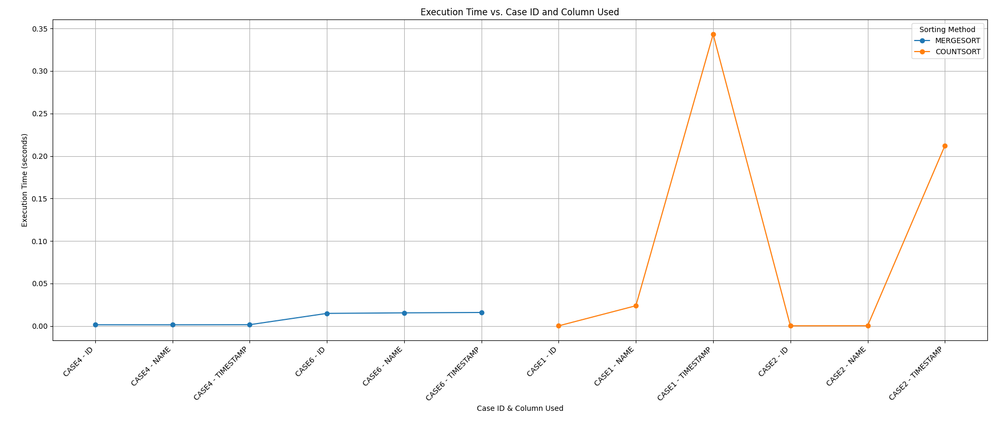
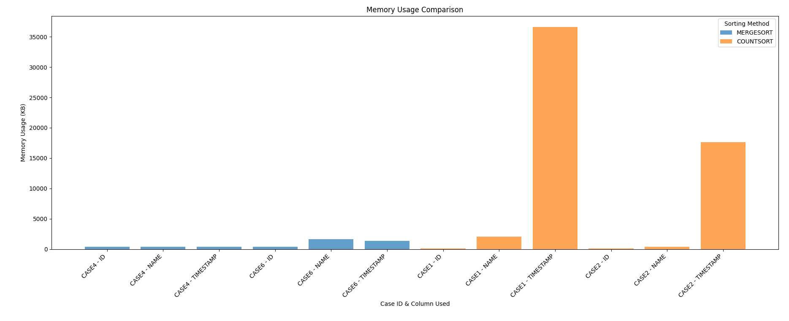

# 1) Implementation Analysis
To run wo finding memory and time consumed: ```gcc finaltry.c -pthread``` and then ```./a.out```
To find memory and time consumed: ```gcc finaltry.c -pthread``` and then ```./try.sh a.out```, this will generate an execution_report.txt which contains the output, memory and time consumed

Countsort
A sort_key is generated from the ID/NAME/TIMESTAMP and is the basis on which items are sorted. In the case of sorting by ID, sort_key is the ID itself. In the case of NAME it is the hash value of the name string. In the case of TIMESTAMP, it denotes the value of time in unix timestamp representation.
We then create a count array to store the frequency of each sort_key within a given range. Sorting is divided among multiple threads, each responsible for a segment of the FileEntry array to compute partial frequencies of sort_key. min_val and max_val of sort_key values are determined for the array, allowing the counting sort to work within this specific range.
The count_thread function calculates the frequency of each sort_key value for a segment of the FileEntry array. Each thread processes a different portion of the array, using a local count array (local_count) to keep track of frequencies. After computing these counts, the function adds them to a shared global count array (args->count), which accumulates the counts from all threads. We use the __sync_fetch_and_add atomic operation for this.

Pros of this approach
1) Sorting in parallel using threads speeds up sorting upto an order of 10^-3 seconds
2) Sorting by id and names(whose hash values are small) is very fast (faster than distributed mergesort) because of the linear O(n) time complexity.

Cons of this approach
1) Since we have to use hash values for name and timestamp, both Memory and Time consumed are very large because of large count arrays needed to accomodate large hashes. As the range of hash values increase time taken to sort even 40 rows tends to 1 second
2) In the case of sparse count arrays i.e. range of values of sort_key is much larger than the number of elements, the performance is poor and better sorting methods exist
3) Order of hash values of timestamps is not in the order of the timestamps in some cases which causes

Mergesort
We have implemented a k-way mergesort. The array is divided into k chunks that are sorted in parallel using multiple thread. K-way merging is implemented which combines the sorted chunks of the multiple sorted subarrays into one.
compare_entries() is used to find the order of 2 items based on the specified column type ID/NAME/TIMESTAMP.
get_min_entry() finds the smallest FileEntry from multiple queues (each representing a chunk of the array) and updates the index of that queue.
k_way_merge() merges k sorted subarrays into one sorted array by selecting the smallest entry from each subarray untill all elements are covered.
parallel_merge_sort() recursively divides the array into smaller subarrays, sorts them using parallel threads if necessary, and merges them back together using k_way_merge.
 
Pros of this approach
1) Using parallel threads for execution makes it very fast for sorting. 10^3 order of elements are sorted in just 10^-2 order of seconds for all the 3 cases of NAME/ID/TIMESTAMP
2) Mergesort performs equally well for all the 3 cases of sorting
3) Memory used is very small even for large cases which is in contrast to countsort method

Cons of this approach
1) Not as fast as countsort in situations where hash values are small because of O(nlogn) complexity
2) We have to limit the no of threads that can be created to prevent the overhead of thread management

# 2) Execution Time Analysis and 3) Memory Usage Overview and 4) Graphs


Testcases on which analysis was performed are given in testcases.txt file. THe exact values of memory and time consumed are given in data.txt file

# Summary
Countsort is very good for cases in which we can find small hash values. Parallel mergesort is good for larger files where techniques like countsort use more memory

Further ptimizations for count sort - One major issue with counting sort for larger datasets is the large memory consumption when the range of sort_key values is large. This can be handled by compressing the range of key values by mapping them to a smaller range. For instance, a hashing technique or a coordinate compression approach to map large keys to smaller indices, reducing the memory usage.
If the range of key values is large but sparse, an array wastes a lot of space. Instead a hash map or a dynamic array like unordered_map/vectors can be used to store only the keys that actually appear in the dataset. This would avoid allocating space for unused key values.

Further ptimizations for merge sort - Merge sort requires extra space for temporary arrays used during the merge phase creating O(n) space complexity. It can be optimized by using an in-place merge algorithm, where the merged result is stored directly in the input array without requiring extra space for a copy of the array.

# Assumptions
The format of any test case should be of the following form:
```
6
ab01 154 1993-09-15T08:10:00
bc02 214 2023-11-20T13:00:00
cd03 152 2001-12-09T16:45:00
de04 115 2021-02-01T08:15:00
ef05 101 2014-11-01T10:55:00
fg06 210 2017-02-25T11:30:00
ID/NAME/TIMESTAMP
```

Name should only be alpha numeric. The length of the name string shouldnt exceed 5/6 characters to ensure the ordering of hashes is same as that of the string ordering id, name, timestamp should be CAPITIALIZED while giving input

The ordering of hashed and the timestamp might be different in the case of countsort, thus an extra variable sort_key is printed which holds the value of hashes to check correctness

